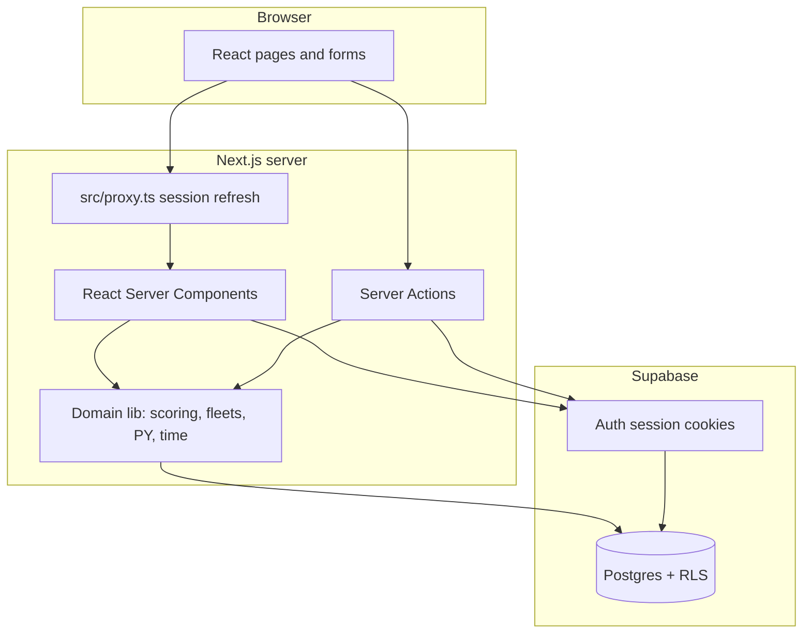

# Architecture overview

Splice is a **club-scoped** dinghy race administration app. Each **group** (club) owns **series**, **races**, fleet definitions, signed-in sailor signups, and **race-only RO-added** results for boats spotted without prior registration. **Supabase Auth** identifies users; **Postgres RLS** enforces access by **group membership** and **role**.

Primary users: **sailors** (fleet, series entry, race-day tally), **club admins** (members, PY, fleets, series maintenance, pending ad-hoc link review), and **race officers** (start line, finishes, ad-hoc boats).

## High-level diagram

## Request and auth flow

1. User signs in via Supabase Auth (session in HTTP cookies).
2. **`src/proxy.ts`** (Next.js 16 **proxy**, replaces deprecated `middleware.ts`) runs on matched routes: refreshes the session via `supabase.auth.getUser()` and sets the **`x-pathname`** header used by the shell layout and **`SiteNav`** for work-mode resolution. Health probes (`/health`, `/api/health`) and static assets are excluded from the matcher.
3. **Server Components** and **Server Actions** call `createClient()` from `src/lib/supabase/server.ts`, which reads/writes cookies via `next/headers`.
4. **`getServerAuth()`** (`src/lib/supabase/auth-cache.ts`) wraps `createClient()` + `getUser()` in React `cache()` so one request does not repeat the handshake.
5. Actions check **`group_memberships.role`** for **club_admin** or **race_officer** before mutating staff-only data; the database still applies **RLS** as the ultimate guard.

## Application structure (Next.js)

| Area | Location |
|------|----------|
| Authenticated shell | `src/app/(shell)/` — home, account, groups, fleet, race officer, club admin, series/races |
| Public results | `src/app/results/[slug]/` — anon RLS, no shell |
| Auth pages | `src/app/(shell)/login`, `signup`, `logout` |
| Server actions | `src/app/actions/` — mutations, redirects, flash via query params |
| UI components | `src/components/` — modals, RO tools, tally, work-mode chrome |
| Domain logic | `src/lib/` — scoring, fleets, PY, club time, Supabase helpers |

## Work modes

Three **work modes** (`WorkMode` in `src/lib/work-mode.ts`) change nav chrome, home URL, and which shortcuts appear. Mode is stored in cookie **`rm_work_mode`** (`sailor` \| `admin` \| `race_officer`).

| Mode | Home | Nav emphasis | Who gets it |
|------|------|--------------|-------------|
| **Sailor** | `/` | My Entries, My boats, Account | Everyone |
| **Admin** | `/club-admin` | Clubs, Club settings | Users with **`club_admin`** on any club |
| **Race officer** | `/race-officer` | Race list | Users with **any** staff membership (`club_admin` **or** `race_officer`) |

**Mode pills** in the header (`WorkModePills`) switch modes via **`setWorkModeAction`**. Opening staff URLs can infer mode from path (`staffRouteWorkMode`). **`ClubStaffModeLinks`** on a club page shows admin/RO shortcuts only outside sailor mode.

Shell theming: `src/components/work-mode-shell.tsx`.

## Route map (authenticated)

### Sailor

| Path | Purpose |
|------|---------|
| `/` | Home dashboard — next-race tally, recent results, amend race details |
| `/fleet`, `/fleet/new`, `/fleet/[boatId]` | My boats (soft retire via `valid_to`) |
| `/groups` | **My Entries** — per-club series schedule & entries (enter/withdraw boats, race lists, standings); find-a-club search |
| `/groups/[id]/series-entries` | Redirects to `/groups#club-{id}` (legacy URL) |
| `/groups/[id]/series/[seriesId]/races` | Sailor race list; **subscribe** to series iCalendar (token URL polled by Apple/Google/Outlook) or one-time `.ics` download; **`STATUS:CANCELLED`** via **`calendar_event_tombstones`** |

Series calendar **subscription**: **`series_calendar_feeds`** (one token per user per series) → **`GET /api/calendar/feeds/{token}`** (no session cookie; membership checked in **`series_calendar_feed_payload`** RPC). Stable event UIDs **`{race_id}@splice`**; replan reuses race rows by sequence.
| `/groups/[id]/series/[seriesId]/standings` | Series standings (back links: Home or series schedule) |
| `/tracks`, `/tracks/new`, `/tracks/[submissionId]` | GPS track upload, race confirm, analysis |
| `/account` | Profile, privacy toggles, Strava link, create club |

Series signup uses **`enterSeriesBulkAction`** (`src/app/actions/enter-series.ts`). Legacy **`/enter-series`** redirects to `/groups`.

### Club admin

| Path | Purpose |
|------|---------|
| `/club-admin` | Hub; single-club admins redirect to `/groups/[id]/club-admin` |
| `/groups/[id]/club-admin` | PY/hulls, timezone, members, RO-added settings, **pending ad-hoc link queue** |
| `/groups/[id]/club-admin/sailing-area` | Chart marks (fixed/laid/line) and course letters for GPS analysis — single Mapbox map, collapsible mark groups, per-course route view with preamble/cross-SF support |
| `/groups/[id]` | Club page — join-request approval (admin mode), series maintenance |
| `/groups/[id]/series/new`, `/series/[seriesId]`, `/scoring`, `/fleets/*` | Series generator, schedule, penalty/discards, club fleet templates |

**Nav badge:** red dot on **My Entries** / **Clubs** when the admin has pending **join requests** or **pending ad-hoc links** (`src/components/site-nav.tsx`).

### Race officer

| Path | Purpose |
|------|---------|
| `/race-officer`, `/race-officer/races` | RO hub and cross-club race list |
| `/groups/[id]/race-officer` | Club-scoped race day entry |
| `…/races/[raceId]/manage` | **Start line** — presence, fleet start signals, ad-hoc add |
| `…/races/[raceId]/finishes` | **Finish capture** — badges, positional/handicap finishes |
| `…/races/[raceId]/track-analysis` | **GPS analysis** — RO course setup, batch fleet analyse |

Fleet gun times: **`race_fleets.start_signal_at`** aligned between admin schedule and RO panel (`src/app/actions/ro-race-start.ts`, `apply_race_fleet_start_signal` in DB).

When **`races.results_final`** is true, new ad-hoc boat adds are disabled on manage/finishes.

## Public results

**`/results/[slug]?series=…`** — unauthenticated club results (`src/app/results/[slug]/page.tsx`, `src/lib/public-club-results.ts`). Uses anon key + RLS (`20261623120000_public_results_anon_rls.sql`). Club must have non-empty **`groups.slug`**. Shows series standings and per-race results with sail, boat, helm/crew where policies allow.

## Major subsystems

### Tenancy and roles

- **`groups`**: club row; creator becomes **`club_admin`** via trigger `handle_new_group`.
- **`group_memberships`**: `(group_id, user_id)` with **`role`**: `sailor` \| `club_admin` \| `race_officer`.
- **Join requests** (`group_join_requests`): non-members request access on `/groups/[id]`; admins approve/decline on the same page (admin work mode).

RLS helpers **`is_group_member(uuid)`** and **`is_group_admin(uuid)`** are **SECURITY DEFINER** to avoid recursive policy checks.

### Hull classes and Portsmouth (PY)

- **`boat_classes`**: catalogue (`class_key`, display metadata, optional **`created_for_group_id`** for club hulls). National seed: `scripts/build-rya-class-seed.mjs`.
- **`boat_class_pn`**: baseline PY per `class_key` (400–2500).
- Overrides: **`series_class_py`**, **`group_class_py`** (see `src/lib/resolve-class-py.ts`).
- Effective PN order: **`series_class_py` → `group_class_py` → `boat_class_pn` → `boats.py_rating`**.
- **`boats.rya_class_key`**: FK into `boat_classes`; **`boats.py_rating`** is boat-level fallback.

Club admins maintain club hulls and baseline PN where RLS allows; **INSERT** on `boat_class_pn` for club keys: `20261314120001_boat_class_pn_insert_rls.sql`.

### Club fleets vs race fleets

- **`group_fleets`** (+ **`group_fleet_classes`**): durable club templates — named fleets, **class_flag**, ordering.
- **`race_fleets`**: per-**race** start lanes — name, **start_offset_minutes**, **`filter_mode`** (`class_keys` \| `py_range`), signal flag, optional **`start_signal_at`**. Staff (`club_admin`, `race_officer`) manage these.

Elapsed/corrected seconds on finishes use **fleet start** (offset or amended gun), not **`race_entries.started_marked_at`**.

### Series, registration, and racing

**Series signup = sailor + boat(s):**

- **`series_registrations`**: one row per person per series.
- **`series_registration_boats`**: one row per **(series, user, boat)** — hull must exist in the sailor's fleet (`boats.owner_user_id`).
- Re-entering merges boat sets (delete/re-insert on signup); duplicate boats are skipped.
- **Tally afloat/ashore** on the home dashboard is only offered for boats **on that series signup** for an upcoming race.

**Race participation:**

- **`race_entries`**: official row per race (user, boat, tally times, outcome, crew JSON, optional **`py_override`**).
- **`race_entries.started_marked_at`**: RO saw boat on start line (presence); distinct from fleet start instant.
- RO start line lists **all series-registered hulls** for the race, including those not yet tallied afloat.

**Schedule:**

- Series generator with confirmation modal before applying race creates/removals.
- **`series.schedule_generation_mode`**: `single_day` \| `date_range`; template fleets in **`schedule_template_fleets`** (jsonb).
- Delete series with recorded results requires password re-entry.

See [race-types.md](./race-types.md) for handicap / level rated / pursuit.

### Finish outcomes

Defined in `src/lib/finish-outcome-labels.ts`:

| Who | Outcomes |
|-----|----------|
| **Sailor** (self-declaration on tally/amend) | `finished`, `retired`, `dns`, `dnc` |
| **Race officer / admin** (finish UI) | `ocs`, `dnf`, `dsq` (plus recording finish times / positions) |

### Scoring

- **`series_scoring_config`**, **`series_penalty_rules`**, **`series_discard_rules`**: Appendix A–style configuration (UI: series scoring page).
- **`src/lib/scoring/`** builds race points and standings from finishes + effective PY.
- Standings include races with **recorded scoring inputs** (provisional or final), not **`results_final`** alone.
- **`elapsed_seconds`**, **`corrected_seconds`**, **`effective_py`** on **`race_finishes`** / **`race_guest_finishes`** are computed in **Postgres triggers** on save.

### Guest (scratch) racing

**Primary path:** signed-in sailor → **`boats`** → **`series_registration_boats`** → **`race_entries`**.

**Race-only (RO-added) path:** RO adds sail + class on start line or finishes (`race_guest_entries` with **`adhoc_sail_number`**, **`adhoc_rya_class_key`**, **`boat_id`** null). Badge: **+ADDED** / race-only. Actions: **`src/app/actions/ro-finishes.ts`**. Default: **one race only**. Optional carry-forward:

- **`groups.ro_added_boats_series_start_line`** — same hull on later series start lines until entered for that race.
- **`groups.ro_added_boats_series_standings`** — aggregate ad-hoc results in series standings by sail + class.

**Legacy guest catalogue:** **`club_guest_sailors`** / guest **`boats`** rows remain in DB and RO/scoring paths for old data; **club admin UI no longer creates them**. Server actions in **`club-guest-sailors.ts`** exist but are unwired from UI. Members modal explains the ad-hoc RO path instead.

**Linking RO results after signup:**

1. Sailor **`INSERT`** on **`series_registration_boats`** → trigger **`series_registration_boats_mark_adhoc_pending`** → **`mark_pending_adhoc_links_for_series_boat`** flags matching unlinked ad-hoc rows (same sail + class, with finish) as **`link_status = pending_admin`**.
2. Admin reviews **`/groups/[id]/club-admin`** queue (`ClubAdminPendingAdhocLinksSection`, **`adhoc-link-admin.ts`**).
3. **Confirm link** — ensure **`race_entries`** row, RPC **`confirm_race_guest_entry_link`**, copy finish to **`race_finishes`**, **`link_status = confirmed`** (audit row retained).
4. **Dismiss** — back to **`unlinked`**, clear pending match fields.
5. **De-link** — club admin tool **`/groups/[id]/club-admin/delink-results`**: search sailor-linked finishes by sail + class, select rows, RPC **`delink_race_entry_to_ro_added`** copies finish back to an unlinked RO-added guest row and removes the official **`race_entries`** row (`src/app/actions/delink-sailor-results.ts`).

Pending queue is **club_admin only** (RPC also allows race_officer but no RO UI for the queue today).

### Sailor home and tally

**`HomeDashboard`** (`src/components/home-dashboard.tsx`):

- **Today's tally board** for the next/current race — afloat/ashore sliders per series-entered hull.
- Tally window from series **`tally_open_hours_before_fleet_start`** / **`tally_close_hours_after_fleet_start`** (`src/lib/tally-window.ts`).
- Amend race details, crew, sailor-declared outcomes.
- Recent race results table grouped by series (position for pursuit/level rated; times for handicap).

### Time zones

- **`groups.iana_timezone`**: IANA identifier (column name has no underscore before `zone`).
- Display: **`src/lib/club-display-format.ts`** — dates **DD/MMM/YYYY**, times **24h HH:MM** (club wall clock).
- Storage: UTC instants; **`datetime-local`** inputs interpreted in club zone (`src/lib/club-zoned.ts`).

## Design choices

- **RLS-first**: authenticated users + policies on domain tables; **service_role** not used by the Next.js server client.
- **Server Actions** for mutations; complex rules in **`src/lib/`**.
- **Explicit PN chain** in code matches override stacking in the schema.

## Related reading

- [data-model.md](./data-model.md) — table inventory
- [security-and-rls.md](./security-and-rls.md) — policy patterns and secrets
- [member-onboarding.md](./member-onboarding.md) — joining and membership
- [race-types.md](./race-types.md) — handicap / level rated / pursuit
- [development.md](./development.md) — local setup
